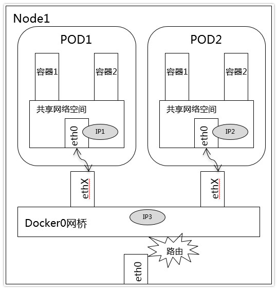

# k8s 多环境调试概述

使用k8s的时候为了解决生产环境和本地调试的矛盾，通常会采用多profile + k8s debug service 的方式

以一个应用场景为例, 假设存在调用关系 

```
A (serviceName: a-service, targetPort: 8080) 
|
|
V
B (serviceName: b-service, targetPort: 8080, nodePort: 18080, nodeIp: 10.1.1.2)
``` 

调用形式为http短链接形式，而调用方式使用了serviceName进行调用(即 http://b-service:8080)

## 一. 基于环境变量的调试方案

当我们在编写应用A的时候需要进行本地调试，这个时候就会遇到一些比较尴尬的情况，由于服务是硬编码在代码内
为了解决这个矛盾，我们不得不在代码层做一些修改。按照云原生的方案，是使用容器环境变量的方式去动态替换。
而代码内使用类似于 place_holder 的方式填充系统变量值。以一个 springboot 项目为例

调用代码形如:

```java
@Component
public class DemoComponent {

    @Value("${B_SERVICE_HOST:b-service}")
    private String bServiceHost;
    
    @Value("${B_SERVICE_PORT:8080}")
    private String bServicePort;

    @Autowired
    private RestTemplate template;

    public void doInvoke() {
        String result = template.getForObject(
            "http://" + bServiceHost + ":" + bServicePort,
            String.class
        );
        // do something with result..
    }

}
```

这样的话，当不存在环境变量时，默认为生产环境；当进行本地调试时， 需要指定额外的环境变量

```
export B_SERVICE_HOST="10.1.1.2"
export B_SERVICE_PORT="18080"
```

这样的调试过程会遇到一个问题，研发人员之间需要口口相传一份本地环境调试的环境变量配置(或者依靠文档规范)。
设想一下研发同学a和b一起编码一个新功能，a新增了redis依赖却没有即使更新环境变量的文档。导致b执行的代码合并后，
本地出现缺少环境变量的情况，影响调试。

> 使用 idea 设置环境变量


## 二. 基于 profile 的设计方案

我们研发过程中往往会遇到几个场景: 生产环境，本地调试，单元测试，压力测试...

我们可以简单的设想一下，假如我们在编码中使用同一个key，并为这些key在不同的场景下赋予不同的value。
这样就能有效地区分不同场景下所使用的环境变量。

在`SpringBoot`中，这样的场景被称之为 [profile](https://docs.spring.io/spring-boot/docs/current/reference/html/boot-features-profiles.html);

调用代码形如:

```java
@Component
public class DemoComponent {

    @Value("${b.service}")
    private String bService;
    
    @Autowired
    private RestTemplate template;

    public void doInvoke() {
        String result = template.getForObject(
            "http://" + bService,
            String.class
        );
        // do something with result..
    }

}
```

定义`application.properties`

```
b.service=b-service:8080
```

如果需要进行本地调试，可以定义 `application-local.properties`

```
b.service=b-service:18080
```

相应地，启动本地调试需要指定激活的 profile 

```
java -jar <jarfile> --spring.profiles.active=local
```

> 使用idea 设置启动项


因此简单理解, profile 为一组特定的变量集合，并且可以常量或者环境变量进行填充。

特别的，由于profile的配置文件与代码在同一CVS下管理，
在这个场景下同学 a 测试通过后，提交了代码，即使在不告知b的情况下，b同学也能使用到正确的测试配置。
因此基于profile的方式也是一种比较好的多环境调试解决方案。

这种场景下往往有一些常见的问题:

>  如果 B 没有暴露 NodePort 怎么办?

需要手动在测试用k8s集群上创建一个debug service来暴露nodePort；
相应的如果调试的应用很多，那么将创建非常多的debug service以映射端口

> 测试环境正确是否生产环境一定正确?

事实上没有任何一个解决方案敢保证这个问题, 毕竟环境的差异摆在那里；
当测试profile调通后，填上生产环境的profile，还得进行一次(运气不好是很多次的)打包换包测试;


## 三. 基于socks5代理统一生产与测试环境

虽然基于 profile 的调试已经是一种比较优秀的方案了，但是事实的绝望却往往比想象中的大。
比如当你入职的时候发现前辈已经 hardcode 了无穷多的生产环境配置，那么这个时候我们应该怎么做呢？

这个时候我们需要得了解一下问题的本质, 即网络环境的差异点:



容器运行的网段与外部网段处于隔离状态;
处于安全策略，通常情况下即使配置路由规则, 也不能从nodeIp所在的网段请求clusterIp所在网段.

container内内使用的的serviceName调用规则，则是依赖了内部的 k8s dns 机制。
这一机制资料很多，本文就不做额外的介绍了

在这种情况下，试想如果我们能开启一个container用作socks5转发并暴露nodePort, 
这样我们就能使用nodeIp所在的网段进行调试了。

本项目就提供了一个socks5转发用配置[socks5-proxy-rc](src/socks5-proxy-rc.yaml)

```
kuebctl create -f socks5-proxy-rc.yaml
```

该配置会创建一个`ReplicationController`和一个`Service`

```
> kubectl get service,rc | grep socks5
service/socks5-proxy-service   NodePort    10.107.203.160   <none>        1080:32766/TCP   2h
replicationcontroller/socks5-proxy-rc   1         1         1       2h
```

默认暴露了 32766 端口，如此一来就可以使用该端口代理本地应用，使用k8s生产环境网络进行调试了

> socks5 启动参数配置


> 再也不用害怕hardcode


